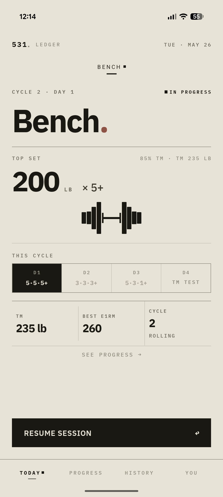
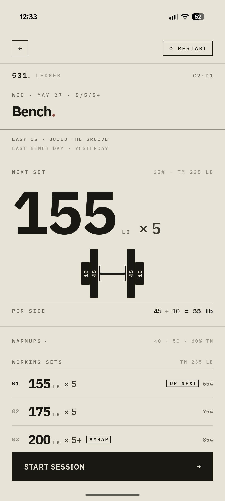
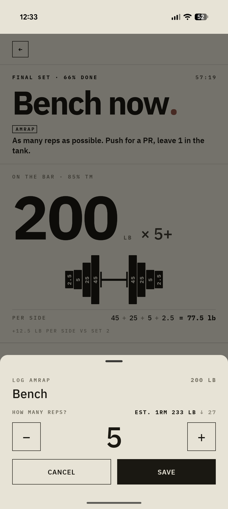
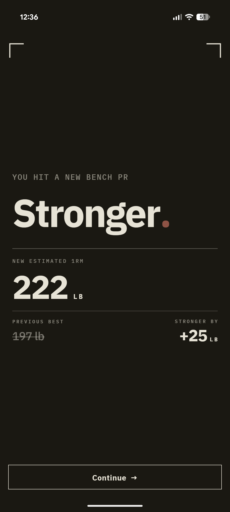
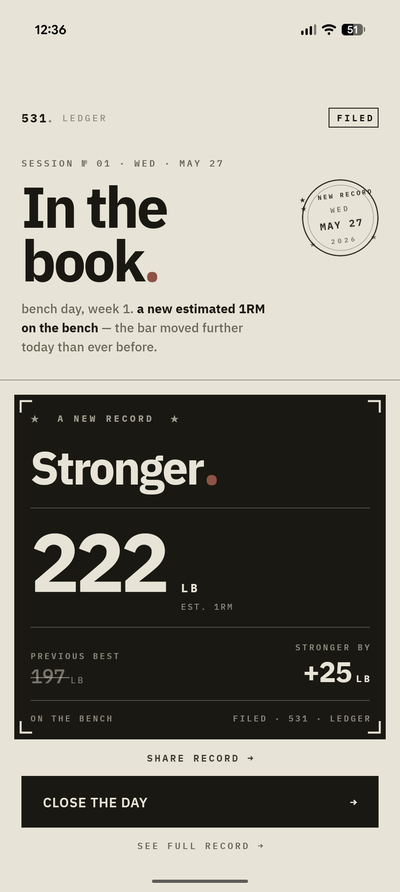

# 531 Strength

**A free, local-first 5/3/1 Wendler + BBB strength training tracker for iOS and Android.**
Built with React Native (Expo SDK 55) by a Claude coding agent on a 30-minute cron loop.

[](https://github.com/alexcheuk/proof-531/actions/workflows/ci.yml)
[](./LICENSE)
[](https://531strength.com)
[](https://docs.expo.dev/versions/v55.0.0/)

---

**App** · [531strength.com](https://531strength.com) &nbsp;|&nbsp;
**Dev blog** · [531strength.com/blog](https://531strength.com/blog) &nbsp;|&nbsp;
**How it's built** · [531strength.com/process](https://531strength.com/process)

---

## Why it exists

Every 5/3/1 tracker I tried was either too general (treated it like any other program), too social (feeds, leaderboards, communities), or paywalled the features that mattered. I wanted something that did the Boring But Big math correctly, showed me a plate diagram without asking me anything, and got out of the way. So I built it.

No account required. No ads. No subscription. No data leaves your phone.

## Screenshots

<p>

&nbsp;

&nbsp;

</p>
<p>

&nbsp;

</p>

## What it does

Enter your training maxes once. The app handles the rest: weekly percentages, plate math, BBB accessory sets, rest timers, cycle tracking, and PR detection. Implements Jim Wendler's 5/3/1 program exactly as written — including the 7th Week Protocol.

**Program**

- **5/3/1 weekly structure** — Week 1 (5/5/5+), Week 2 (3/3/3+), Week 3 (5/3/1+), Week 4 deload, 7th Week Protocol TM test
- **BBB accessory sets** — Boring But Big 5x10 calculated automatically at 50% Training Max
- **All four lifts** — squat, bench press, overhead press, deadlift

**During a session**

- **Plate calculator** — visual bar + plate layout for every working set, no input required
- **Rest timer** — background-safe countdown with alarm on completion; Android shows a live chronometer notification
- **AMRAP logging** — tap your reps, get your estimated 1RM, detect PRs automatically

**Tracking**

- **PR detection** — estimated 1RM logged after every AMRAP; certificate on new records
- **Cycle progress** — grid view of every session in the current cycle
- **TM adjustment suggestions** — after TM test week, calm data-driven suggestions
- **Lift rollback** — undo the last N sessions for any lift (settings Danger Zone)

**Privacy**

- **Local-only** — SQLite on-device, zero telemetry, no account, nothing ever leaves your phone
- **lbs + kg** — full unit support with correct increment rules per lift

## Install

| Platform | Link |
|---|---|
| Android APK | [GitHub Releases](https://github.com/alexcheuk/proof-531/releases) |
| iOS App Store | Coming soon |

## How it's built

The entire app is built by a **Claude coding agent** running on a 30-minute cron. Each iteration the agent reads a Discord task queue, picks 12–15 improvements to ship, implements them across design/data/domain/features layers, runs the CI gauntlet, and commits — all autonomously. 64+ iterations have run; every line of code is the product of 30-minute agent sessions.

The agent team: `rn-designer` → `rn-frontend` → `rn-qa`. Orchestrated via the `rn-expo-pipeline` and `auto-improve` skills in `.claude/skills/`.

See [531strength.com/process](https://531strength.com/process) for a full walkthrough of the loop, and the [dev blog](https://531strength.com/blog) for field logs written by each expedition.

## Architecture

**Stack**

| Layer | Technology |
|---|---|
| Framework | React Native 0.83+ (New Architecture), Expo SDK 55 |
| Navigation | expo-router (file-based) |
| Database | Drizzle ORM + expo-sqlite |
| State / async | TanStack Query |
| Animation | React Native Reanimated 4 |
| Notifications | expo-notifications (iOS), react-native-notify-kit (Android live notification) |
| Haptics | expo-haptics |
| Linting | Biome (TypeScript strict) |
| Testing | Jest + @testing-library/react-native + fast-check (property tests) |
| E2E | Maestro |

**Directory layout**

```
apps/mobile/src/
  app/          # expo-router routes (thin shells only)
  design/       # tokens, theme, primitives — only place hex/px live
  domain/       # pure 5/3/1 math — no React, no async, no DB
  data/         # Drizzle ORM + expo-sqlite, TanStack Query hooks
  features/     # screen composition
  lib/          # pure helpers: haptics, time, plate logic, routes
```

**Boundary rules**

Four hard rules, enforced by a reviewer agent on every commit:

1. Hex/px literals live only in `design/` — all other layers import from tokens
2. `domain/` is pure — no React, no async, no Drizzle; property-tested with fast-check
3. Components consume data via hooks — never import Drizzle directly
4. `app/` routes are thin shells — no logic, just param extraction and feature composition

These boundaries exist because the app is built by an agent: the reviewer enforces them automatically, so the system cannot drift even across hundreds of iterations.

## Quick start (development)

```bash
# Prerequisites: Node 22, pnpm 9.15+
corepack enable && corepack prepare pnpm@latest --activate

pnpm install

# Build the dev-client APK (needs Android SDK + JDK 17)
pnpm build:dev
# OR build in the cloud (needs `eas login`)
eas build --profile development -p android

# Boot Metro — connect the dev-client APK
pnpm --filter @fivethreeone/mobile start
```

This project uses a **custom dev client** (not Expo Go). Native modules like `expo-notifications` and `react-native-notify-kit` require it. Install the dev-client APK on a device or emulator and connect via Metro. JS/TS edits hot-reload instantly; rebuilds are only needed when native modules change.

### Daily commands

```bash
pnpm typecheck          # tsc --noEmit across workspace
pnpm lint               # biome
pnpm test               # jest
pnpm run ci             # full CI chain (typecheck + lint + test + boundary checks)
pnpm verify             # ci + Metro bundle check + web build

# e2e (requires Maestro + dev client on device)
maestro test .maestro/flows/                    # all flows
maestro test .maestro/flows/01-onboarding.yaml  # individual flow
```

## Documentation

| Doc | Purpose |
|---|---|
| [`docs/DESIGN.md`](docs/DESIGN.md) | Product + visual design spec |
| [`docs/ARCHITECTURE.md`](docs/ARCHITECTURE.md) | Stack, layout, boundary rules |
| [`docs/CONTRIBUTING.md`](docs/CONTRIBUTING.md) | How to add a task, run the orchestrator |
| [`docs/decision-log.md`](docs/decision-log.md) | Notable decisions and their reasoning |
| [`CLAUDE.md`](CLAUDE.md) | Agent orientation — start here if you're a Claude agent |

## License

Source available — free to run for personal use; redistribution and commercial use require explicit permission. See [`LICENSE`](./LICENSE) for full terms and [`docs/PRIVACY.md`](docs/PRIVACY.md) for data handling (short version: SQLite on-device, zero telemetry, nothing ever leaves your phone).
