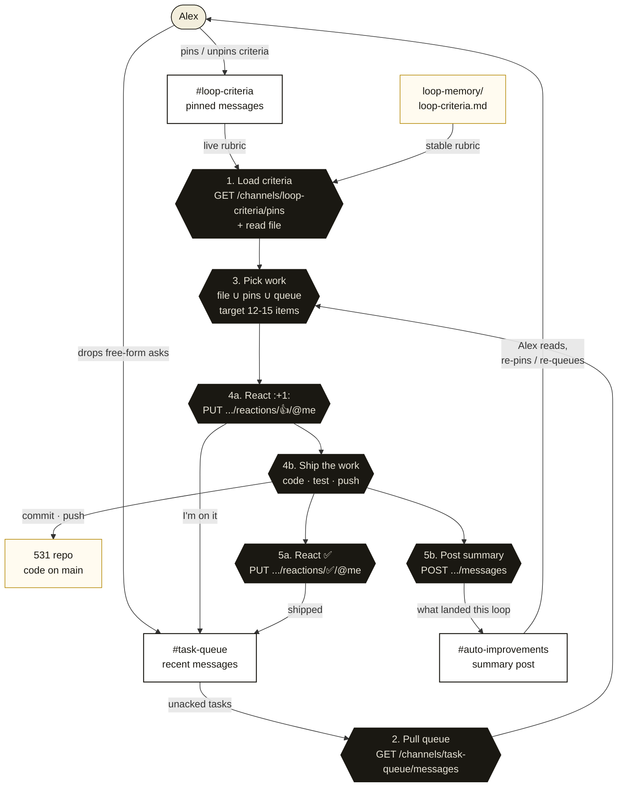

# The Discord loop cycle

How a single `/do-work` iteration reads from Discord, ships work, and writes back to Discord. The diagram below is the contract - the `do-work` skill follows it step-for-step, and `loop-memory/discord-channels.md` holds the exact curl recipes for every numbered call.

## Channel map

Three Discord channels participate in every loop. None of them are interchangeable.

| Channel | Direction | What lives there | Bot writes? |
|---|---|---|---|
| `#loop-criteria` | Alex → loop | **Pinned** messages = live "must-cover this loop" rules. The pin list IS the live rubric, on top of `loop-memory/loop-criteria.md`. Unpinned messages are noise — ignored. | No. Pins are managed by Alex; the bot only reads. |
| `#task-queue` | Alex → loop, loop → Alex | Free-form requests, one per message. The bot reacts `:+1:` when it picks an item up, `:white_check_mark:` when the work ships. | Reactions only. |
| `#auto-improvements` | loop → Alex | End-of-loop summary, one post per iteration. Grouped by category, calls out wins + deferrals. | Yes. |

## The cycle

## What each step does

1. **Load criteria.** The loop opens by reading two surfaces in parallel: `GET /channels/<#loop-criteria>/pins` for Alex's live rules, and every `.md` under `loop-memory/` (which contains the stable rubric in `loop-criteria.md`). Pins are additive; on conflict the pin wins. An empty pin list is fine — file is the whole rubric.

2. **Pull queue.** `GET /channels/<#task-queue>/messages?limit=100`. Each message's `reactions[].me` field tells the loop whether the bot already acked it; everything un-acked is fair game for this iteration.

3. **Pick work.** Union the criteria categories (file + pins) with the queue messages the loop intends to close. Target 12–15 substantive items. Bigger > smaller — the 30-minute cadence is not a deadline.

4. **Ship.** Before starting each queued item, react `:+1:` (`PUT /channels/<id>/messages/<id>/reactions/%F0%9F%91%8D/@me`) so Alex can see the bot picked it up. Then write the code: design + frontend + QA via the agent harness, with typecheck/lint/test/bundle-check in the background. Commit, push. OTA is published automatically by the CI workflow on push to `main`.

5. **Close the loop.** For every queued item that actually shipped, react `:white_check_mark:` (`%E2%9C%85`). Then post a humanized summary to `#auto-improvements` — `POST /channels/<id>/messages` with `allowed_mentions.parse:[]` so a stray `@everyone` in a commit subject doesn't ping the world. The summary calls out wins, anything deferred, and any pinned criterion the loop couldn't satisfy (by pin ID + reason).

The cycle then closes: Alex reads the summary, decides what to keep, pins new criteria or drops new asks in `#task-queue`, and the next loop starts from there.

## Why pins (not messages)?

A flat `#loop-criteria` channel with every message treated as a criterion would either swell into noise (every off-the-cuff "while you're in there…") or require manual `:-1:` acks to retire things. Pins are the right primitive: Discord already exposes them as a curated list, the UX of pin/unpin is one click, and the count cap (50) is comfortably above any realistic criteria count. A pinned message is exactly "this is a rule right now"; unpinning it is exactly "this rule is retired" — no extra state to model.

## Forbidden compositions

- **Don't `:+1:` an item you don't intend to ship this iteration.** `:+1:` means "I'm on it now" — using it as a soft "saw this" breaks the queue's ack contract.
- **Don't write to `#loop-criteria` from the bot.** That channel is human-curated. If the loop wants to suggest a criterion, it goes in the `#auto-improvements` summary as a proposal — Alex pins it if it sticks.
- **Don't post anything but the summary to `#auto-improvements`.** That channel is one-post-per-loop. Status pings, debug output, errors all belong in the summary post itself (or in logs), not as separate messages.
